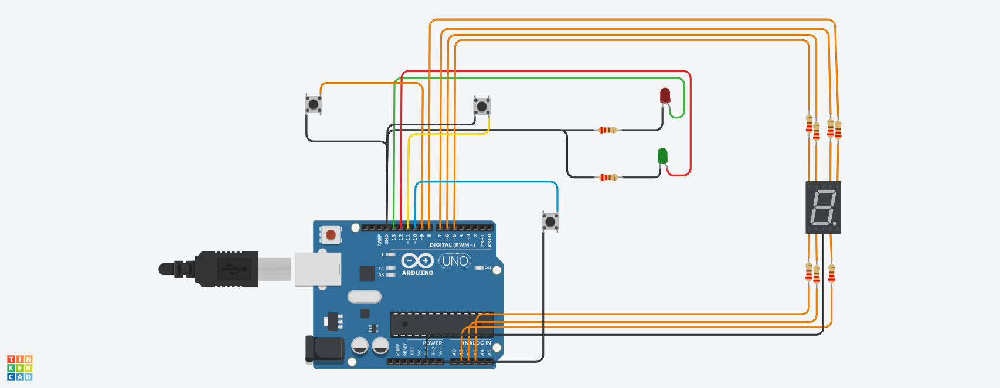

# PRIMER PARCIAL SPD UTN 2023


*ALUMNO: Luis Enrique Atoche Castro*

*DIVISION: 1ro J*

## PROYECTO:  
MONTACARGAS
## CONSIGNA:
*Se deberá armar un modelo de montacarga funcional como maqueta para un hospital. El sistema deberá recibir ordenes de subir, bajar o pausar desde diferentes pisos y mostrar el estado actual del montacargas en el display 7 segmentos.*



## DESCRIPCION:
*El programa arranca en el piso cero a la espera de que uno de sus botones sea pulsado. Si se pulsa el boton de subida sube un piso que se muestra tanto en el display 7 segmentos como por pantalla serial. Idem para el boton de bajada.
Un led verde se enciende cuando el montacarga está en movimiento y cuando se detiene se apaga y enciende uno rojo.
El recorrido entre pisos es de 3 segundos. Cuando el boton de pausa viene pulsado el sistema se detiene y los botones de subida y bajada no funcionan hasta que nuevamente se pulse el boton de pausa*

[enlace al proyecto tinkercad](https://www.tinkercad.com/things/by1mgYwkU8d)
## FUNCIONAMIENTO:
*En esta primera parte defino y declaro las variables a utilizar:*
```
// LUIS Atoche 1roJ
//Primer Parcial Montacargas
#define LED_ROJO 13
#define LED_VERDE 12
#define LED_A 7
#define LED_B 8
#define LED_G 5
#define LED_F 6
#define LED_C A1
#define LED_D A2
#define LED_E A3
#define boton_asc 9
#define boton_dsc 11
#define boton_pausa 10
int estado_pausa;
int estado_asc;
int estado_dsc;
int estado_final = 0;
int estado_actual = 0;
int n = 0;
int c = 0;
```
*Establezco y determino las salidas y entradas digitales para los led y para los botones:*
```
void setup()
{
  Serial.begin(9600);
  pinMode(13, OUTPUT);
  pinMode(LED_VERDE, OUTPUT);
  pinMode(LED_A, OUTPUT);
  pinMode(LED_B, OUTPUT);
  pinMode(LED_C, OUTPUT);
  pinMode(LED_D, OUTPUT);
  pinMode(LED_E, OUTPUT);
  pinMode(LED_F, OUTPUT);
  pinMode(LED_G, OUTPUT);
  pinMode(boton_asc, INPUT_PULLUP);//declaro los botones usando la resistencia interna del arduino
  pinMode(boton_dsc, INPUT_PULLUP);
  pinMode(boton_pausa, INPUT_PULLUP);
}
 ```
*Ciclo principal donde hago el llamado a mis funciones:*
```
void loop() 
{
   mostrar_numero(n);//muestra n en el display7s q inicialmente vale 0
   delay(50);
   calcular_numero_display();
   mostrar_serial();   
}

```
*funcion que muestra por el monitor serial el piso en que se encuentra, n es el numero de piso:*
```
void mostrar_serial()//Muestra por el monitor serial en que piso se encuentra
{
  if(estado_final == 0)
  { Serial.print("Piso: ");
    Serial.print(" ");
    Serial.println(n);
  }
} 
```
*funcion que calcula n, dependiendo de si es presionado el boton de subida o bajada incrementa o decrementa un contador(n) que luego devuelve:*
```
int calcular_numero_display()//calcula y devuelve un entero que sera usado por mostrar_numero()
{
  estado_asc = digitalRead(boton_asc);//tomo las lecturas iniciales y las asigno a las respectivas variables
  estado_dsc = digitalRead(boton_dsc);
  estado_pausa = digitalRead(boton_pausa);
  estado_actual = calcular_estado_pausa();//asigna a una variable la cuenta hecha en la funcion calcular_estado_pausa()
  digitalWrite(LED_ROJO,HIGH);
  if( estado_actual == 0)//para ingresar al ciclo compara si estado_actual es cero
  {  
     if(estado_asc == LOW)//si es apretado el boton asc entra
     { 
       n++;  
       if (n<=9)
       {  
          digitalWrite(LED_ROJO,LOW); 
          digitalWrite(LED_VERDE,HIGH);
          Serial.println("SUBIENDO"); 
          delay(3000); 
          digitalWrite(LED_VERDE,LOW);  
       }
       else 
       {       
           n = 9;
       } 
     }
  
     if (estado_dsc == LOW)//si es apretado el boton dsc entra
     {
       n--;
       
       if (n>=0)
       {
        Serial.println("BAJANDO"); 
        digitalWrite(LED_ROJO,LOW); 
        digitalWrite(LED_VERDE,HIGH); 
        delay(3000);
        digitalWrite(LED_VERDE,LOW); 
       }
       else
       { 
        n = 0;
       }  
     } 
  } 
}
```
*funcion que calcula el estado del boton entre 1 y cero.Cada vez que se presiona el boton de pausa se incrementa el contador (C), este valor se le resta a estado final que inicialmente es 1.Si el contador es mas de 1 se resetea a 0.
Devuelve el entero estado_final*
```
int calcular_estado_pausa()//calcula el estado del boton de pausa
{  
  if(estado_pausa == LOW)
  {
   delay(400); 
   if(c>1) 
   {c = 0;} 
   estado_final= 1-c;
   c++;
   Serial.println("PAUSADO");
  }
  return estado_final;      //retorna un entero
}
```
*Esta funcion recibe n que fue calculada en calcular_numero_display y a traves de un switch iluminar cada numero en el display 7 segmentos:*
```
void mostrar_numero(int n)//Ilumina el display 7 segmentos segun el entero que fue calculado en calcular_numero_display()
{  
    switch(n)   
       {
        case 0:
              digitalWrite(LED_A, HIGH);
              digitalWrite(LED_B, HIGH);
              digitalWrite(LED_C, HIGH);
              digitalWrite(LED_D, HIGH);
              digitalWrite(LED_E, HIGH);
              digitalWrite(LED_F, HIGH);
              digitalWrite(LED_G, LOW);
              break;
             
        case 1:
              digitalWrite(LED_A, LOW);
              digitalWrite(LED_B, HIGH);
              digitalWrite(LED_C, HIGH);
              digitalWrite(LED_D, LOW);
              digitalWrite(LED_E, LOW);
              digitalWrite(LED_F, LOW);
              digitalWrite(LED_G, LOW);
              break;
             
         case 2:
              digitalWrite(LED_A, HIGH);
              digitalWrite(LED_B, HIGH);
              digitalWrite(LED_C, LOW);
              digitalWrite(LED_D, HIGH);
              digitalWrite(LED_E, HIGH);
              digitalWrite(LED_F, LOW);
              digitalWrite(LED_G, HIGH);
              break;
              
           case 3:
              digitalWrite(LED_A, HIGH);
              digitalWrite(LED_B, HIGH);
              digitalWrite(LED_C, HIGH);
              digitalWrite(LED_D, HIGH);
              digitalWrite(LED_E, LOW);
              digitalWrite(LED_F, LOW);
              digitalWrite(LED_G, HIGH);
              break;
      
           case 4:
              digitalWrite(LED_A, LOW);
              digitalWrite(LED_B, HIGH);
              digitalWrite(LED_C, HIGH);
              digitalWrite(LED_D, LOW);
              digitalWrite(LED_E, LOW);
              digitalWrite(LED_F, HIGH);
              digitalWrite(LED_G, HIGH);
              break;
      
           case 5:
              digitalWrite(LED_A, HIGH);
              digitalWrite(LED_B, LOW);
              digitalWrite(LED_C, HIGH);
              digitalWrite(LED_D, HIGH);
              digitalWrite(LED_E, LOW);
              digitalWrite(LED_F, HIGH);
              digitalWrite(LED_G, HIGH);
              break;
   
           case 6:
              digitalWrite(LED_A, HIGH);
              digitalWrite(LED_B, LOW);
              digitalWrite(LED_C, HIGH);
              digitalWrite(LED_D, HIGH);
              digitalWrite(LED_E, HIGH);
              digitalWrite(LED_F, HIGH);
              digitalWrite(LED_G, HIGH);
              break;
      
           case 7:
              digitalWrite(LED_A, HIGH);
              digitalWrite(LED_B, HIGH);
              digitalWrite(LED_C, HIGH);
              digitalWrite(LED_D, LOW);
              digitalWrite(LED_E, LOW);
              digitalWrite(LED_F, LOW);
              digitalWrite(LED_G, LOW);
              break;
      
           case 8:
              digitalWrite(LED_A, HIGH);
              digitalWrite(LED_B, HIGH);
              digitalWrite(LED_C, HIGH);
              digitalWrite(LED_D, HIGH);
              digitalWrite(LED_E, HIGH);
              digitalWrite(LED_F, HIGH);
              digitalWrite(LED_G, HIGH);
              break;
      
           case 9:
              digitalWrite(LED_A, HIGH);
              digitalWrite(LED_B, HIGH);
              digitalWrite(LED_C, HIGH);
              digitalWrite(LED_D, HIGH);
              digitalWrite(LED_E, LOW);
              digitalWrite(LED_F, HIGH);
              digitalWrite(LED_G, HIGH);
              break;     
        }         
}
```
## DIAGRAMA ESQUEMATICO:
[diagrama](https://github.com/LuisAtocheUTNFRA/PrimerParcialSPD/blob/main/diagramaEsquematico.pdf)


